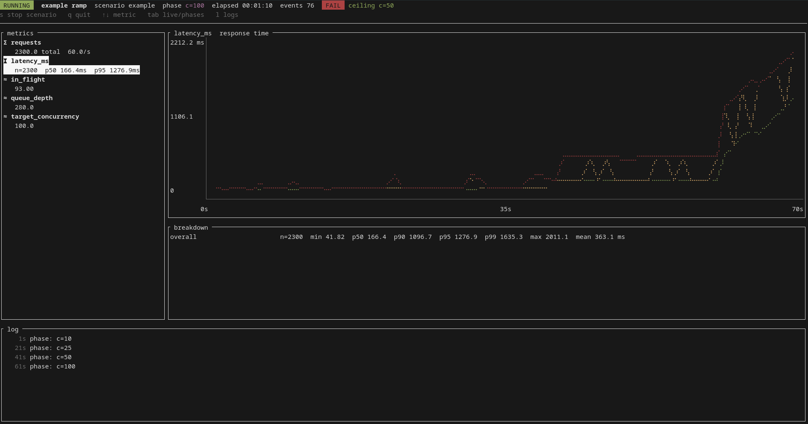

# tutui

tutui is a terminal dashboard for load tests. A scenario generates load and
reports measurements; tutui graphs those measurements as they arrive, checks
thresholds, and saves the run for later replay. Scenarios can be written in
Rust or in any language that can write JSON Lines to stdout.



*The bundled example ramp at the moment `c=100` saturates a backend capped at 60 req/s. p50/p95/p99 fan apart, the header flips to FAIL and names the last passing stage as the ceiling.*

## Why

Summary numbers can hide when a system started to struggle. tutui shows latency
percentiles, counters, gauges, and labelled errors while a test is running. It
also evaluates thresholds for each phase, so a ramp test can tell you the last
concurrency level that passed.

## Concepts

| | |
|---|---|
| Scenario | An implementation of `tutui::Scenario`. It declares metrics, generates load, and sends measurements through a `Recorder`. Scenarios normally live with the system they test. |
| Registry | The scenarios available from a binary. The supplied `tutui` binary has the `process` scenario; a custom binary can register native Rust scenarios. |
| Run config | A file in `runs/*.json` containing `name`, `scenario`, `params`, `thresholds`, and `chart_window_seconds`. tutui passes `params` to the scenario without interpreting them. |
| Metric kinds | A `counter` has a per-second rate, a `gauge` has a current value, and a `histogram` has p50/p95/p99 values backed by an HDR histogram. Labels split a metric into groups. |
| Phase | A named part of a run. Metrics are tabulated by phase, making the steps in a ramp test (`c=5`, `c=10`, and so on) easy to compare. |
| Threshold | A rule applied to a metric statistic for each phase and for the whole run. |
| Ceiling | The last phase in which every applicable threshold passed. |
| Report | Three files under `reports/`: replayable events in `.events.jsonl`, machine-readable results in `.summary.json`, and a Markdown summary. |

Keys: `s` stop the scenario · `q` quit · `↑↓` select metric · `tab` live / phase table · `l` toggle log pane.

## Writing a scenario in Rust

```rust
use tutui::{async_trait, labels, MetricSpec, Registry, RunContext, Scenario, Value};

struct Ping;

#[derive(serde::Deserialize)]
struct Params { url: String, concurrency: usize, seconds: u64 }

#[async_trait]
impl Scenario for Ping {
    fn id(&self) -> &str { "ping" }
    fn description(&self) -> &str { "GET a URL at fixed concurrency" }
    fn metrics(&self) -> Vec<MetricSpec> {
        vec![
            MetricSpec::histogram("latency_ms", "ms", "response time"),
            MetricSpec::counter("requests", "responses by status"),
        ]
    }
    async fn run(&self, ctx: RunContext) -> anyhow::Result<Value> {
        let p: Params = ctx.params()?;
        ctx.recorder.phase(format!("c={}", p.concurrency));
        while !ctx.cancel.is_cancelled() {
            // … issue a request, measure it …
            ctx.recorder.observe("latency_ms", elapsed_ms);
            ctx.recorder.count_labeled("requests", labels([("status", status.to_string())]));
        }
        Ok(serde_json::json!({ "note": "anything here lands in the report" }))
    }
}

#[tokio::main]
async fn main() -> anyhow::Result<()> {
    tutui::cli::main(Registry::new().register(Ping)).await
}
```

The shared CLI provides the run picker, dashboard, headless mode, replay,
threshold checks, and reports. `RunContext.cancel` is a `CancellationToken`.
Check it in long-running work so the `s` key can stop the scenario cleanly.

## Writing a scenario in anything else

Print one JSON object per line to stdout and use the `process` scenario. The
[protocol documentation](docs/PROTOCOL.md) describes each event type. There is
also a complete [JavaScript example](docs/example-scenario.mjs) with a matching
[run configuration](runs/example.json):

```
cargo run -p tutui-cli -- run runs/example.json
```

## Thresholds and results

```json
"thresholds": [
  { "metric": "latency_ms", "stat": "p95", "max": 500 },
  { "metric": "requests", "stat": "share", "labels": { "status": "200" }, "min": 0.99 },
  { "metric": "queue_depth", "stat": "slope", "max": 0, "skip_phases": ["warmup"] }
]
```

The available statistics depend on the metric kind:

| Kind | Statistics |
|---|---|
| Histogram | `p50`, `p90`, `p95`, `p99`, `max`, `mean`, `count` |
| Counter | `total`, `rate`, `share` |
| Gauge | `last`, `max`, `mean`, `slope` |

`share` is the labelled count divided by the total count, so it requires
`labels`. `slope` is the change per second over a phase. For example, a positive
queue-depth slope means work is accumulating. A threshold is skipped for any
phase where its metric has no data. `skip_phases` skips phases whose names start
with one of the supplied strings.

The dashboard updates the PASS or FAIL result during a run. The final summary
records the ceiling and the first phase that failed.

## Commands

```
<binary>                                   # picker over runs/*.json
<binary> run runs/x.json                   # one run with the dashboard
<binary> run runs/x.json --headless        # no TTY: log lines + summary
<binary> replay reports/x.events.jsonl [--speed 10] [--thresholds-from runs/x.json]
<binary> report reports/*.summary.json -o report.md
<binary> scenarios
```

`--runs-dir` and `--report-dir` override the defaults.

## Design notes

- Events travel over an unbounded channel and are drained once per frame, so rendering does not block the scenario.
- The dashboard groups measurements using its 250 ms clock tick. If a scenario stalls, the graph shows a flat line instead of a gap.
- Histograms use three-significant-digit HDR values stored in micro-units. The same metric can hold sub-millisecond timings and waits measured in hours.
- `Recorder` is `Clone + Send`, so each task can keep its own copy. The event stream ends when the last copy is dropped.
- Scenario crates contain the details of the system under test. The dashboard does not need to know what is generating the measurements.

## Licence

MIT.
